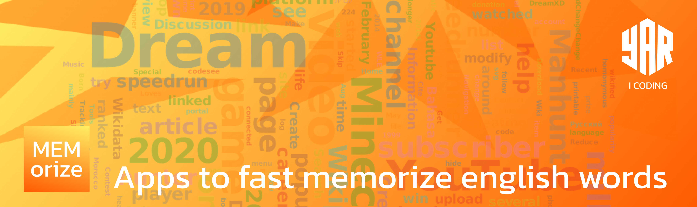
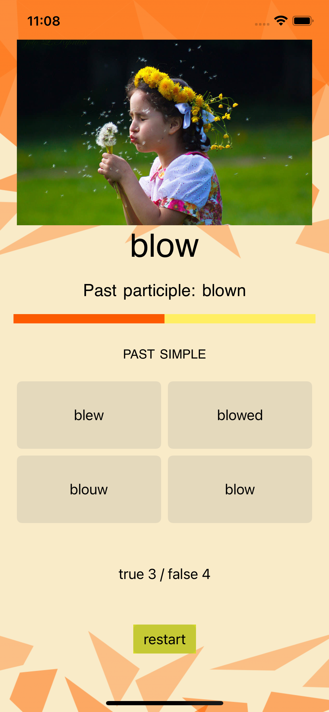

# fast-memorize
apps to fast memorize english words

проект
+ MVC 
+ AVFoundation

## Цель

Цель создать приложения для быстрого запоминания английских глаголов pastSimple
дизайн разработан в figma 

## Структура
+ Models
    * WordsBrain
    * Memorizer
+ View
    * Main.storyboard
+ Controller
    * ViewController

## Механика
При старте запускается таймер и отсчитывает 10 сек. за это время пользователь должен выбрать ответ, если ответ верный раздается звук правильного ответа, кнопка подсвечивается зеленым и через 0,2 сек происходит смена вопроса, в случае неверного ответа раздается звук ошибки и кнопка подсвечивается красным, все ответы фиксируются в строке счета

